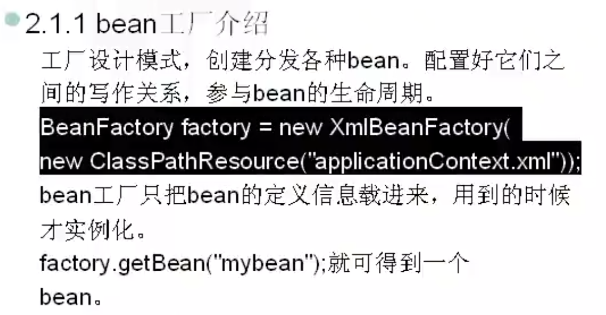

# springApplicationContext与bean工厂的区别

### 1.使用springApplicationContext获取bean,当我们去实例化beans.xml时，不管你有没有获取bean,该文件中配置的bean都会被实例（前提是bean的scope被配置成了signal）

### 2.什么是bean工厂

使用beanfactory去获取bean的时候，只是实例化该容器，那么容器中的bean不会被创建，只有当你去getbean时，才会实时的创建这个bean.


### 3.bean的scope
* 测试单例模式
```
@Bean
  @Scope("singleton")
  public ByeWorld byeWorld(){
      return new ByeWorld();
  }
```
```
ByeWorld byeWorld = ac.getBean(ByeWorld.class);
       ByeWorld byeWorld2 = ac.getBean(ByeWorld.class);
       System.out.println(byeWorld +" "+ byeWorld2);
```
会发现这两个bean的地址是一样的。所以说是单例的。
单例的，不管你用不用，都会默认被实例，调用构造方法。（浪费内存）
* 如果把配置改成
```
@Bean
   @Scope("prototype")
   public ByeWorld byeWorld(){
       return new ByeWorld();
   }
```
表示每次都是全新的。会发现两个地址是不一样的。当不适用这个bean时，不会调用构造方法。
* scope还有request,session,global-session只有在web开发中才有意义。

### 3.三种获取applicationContext的方法
* 1.ClassPathXmlApplicationContext
* 2.FileSystemXmlApplicationContext:从文件系统获取
* 3.是从webconfigution中获取。
