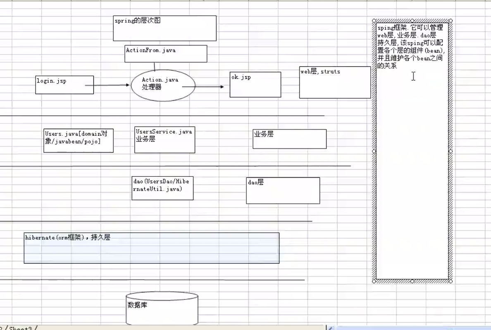

# spring入门
spring是一个容器管理框架，他和其他容器之间的关系。



### 1.spring项目set up
看了韩老师的视屏，这里采用的是spring 原始的xml配置，不过确实讲的很清楚。上网查了下，现在比较流行的是代码配置，也就是不采用xml的配置，因为这样当配置的多了的话，确实看起来不是很清楚。现在是用代码的方式来代替xml配置的形式，需要使用注解。参考的连接为：
```
https://www.tutorialspoint.com/spring/spring_java_based_configuration.htm
```

gradle
```
group 'com.studey.spring'
version '1.0-SNAPSHOT'

apply plugin: 'java'
apply plugin: 'idea'

sourceCompatibility = 1.8

repositories {
    mavenCentral()
}

dependencies {
    compile 'org.springframework:spring-context:5.0.4.RELEASE'
    testCompile group: 'junit', name: 'junit', version: '4.12'
}

```

HelloWorldConfig.java

```
package com.tutorialspoint;
import org.springframework.context.annotation.*;

@Configuration
public class HelloWorldConfig {
   @Bean
   public HelloWorld helloWorld(){
      return new HelloWorld();
   }
}
```
这段代码就类似于xml中的
```
<beans>
   <bean id = "helloWorld" class = "com.tutorialspoint.HelloWorld" />
</beans>
```

HelloWorld.java

```
package com.tutorialspoint;

public class HelloWorld {
   private String message;

   public void setMessage(String message){
      this.message  = message;
   }
   public void getMessage(){
      System.out.println("Your Message : " + message);
   }
}
```
App.java
```
@Configuration
public class App {

    public static void main(String[] args) {
        ApplicationContext  ac = new AnnotationConfigApplicationContext(HelloWorldConfig.class);

        HelloWorld helloWorld = ac.getBean(HelloWorld.class);
        helloWorld.setMessage("你好！");
        helloWorld.getMessage();
    }

}
```
